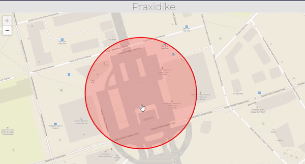

# Praxidike

> Това е проект за Hackaton Бургас 2021 от eccy, Joan, smensmen and thefallenking

## Инсталиране

Изтеглете проекта като .zip или в Git Bash използвайте:

```git
git clone https://github.com/Zakrok09/Praxidike
```

За да използвате модела, ще Ви е нужен Python (използваната в приложението версия е 3.9.2)

Ще Ви е нужно да инсталирате tensorflow. Направете го в среда остановена за работа с python от [pipenv](https://pypi.org/project/pipenv/).

```cmd
pip install --upgrade tensorflow
```

## Езици за програмиране

> Приложението е написано на: HTML5, CSS3, JavaScript ES6 ECMAScript 2018 (като са използвани и legacy елементи), Python, 

## Използване и описание на уеб приложението

Приложението показва нивото на струпване на хора в отделни локации на града като взима информация и я обработва през обучен модел. Местата са:

- Паметник "Альоша"
- Център
- Хотел България
- Богориди
- Морска Гара
- Морски театър
- Детски кът (до Флора)
- Сарафово (градинка)
- Пристанище Сарафово

**ВАЖНО**: приложението не ползва актуална информация. На сайта е показана само симулация.

На заглавната страница на приложението се виждат няколко такива зони, които си променят цвета спрямо това какво е нивото на струпването на хора.

1. Червено - много хора
2. Жълто - средно натрупване на хора
3. Зелено - малко хора


На фигурата отдолу може да видите как едно такова се обновява: 



## Модел

Моделът е конволюционна невронна мрежа, която изпълнява класификация

## Ползвани сайтове, разработки и структури

За сайта са ползвани [leaflet.js](https://leafletjs.com/), [MapTiler](https://www.maptiler.com/).

За документацията са ползвани [EZGif](https://ezgif.com/), [Lightshot](https://app.prntscr.com/en/index.html).

За позлването на модела са ползвани [CUDA](https://en.wikipedia.org/wiki/CUDA), [python](https://www.python.org/).

### За да разгледате кода отворете файла: [CODE.md](./CODE.md)

### ПРОЕКТЪТ Е ЛИЦЕНЗИРАН ПОД MIT ЛИЦЕНЗ
